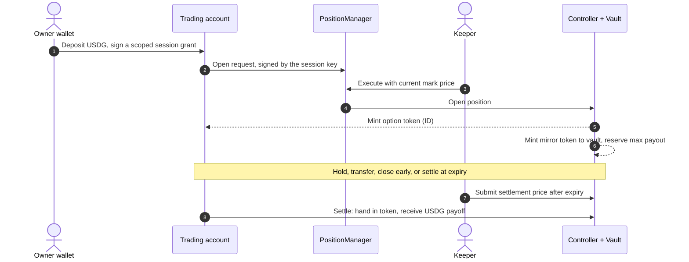
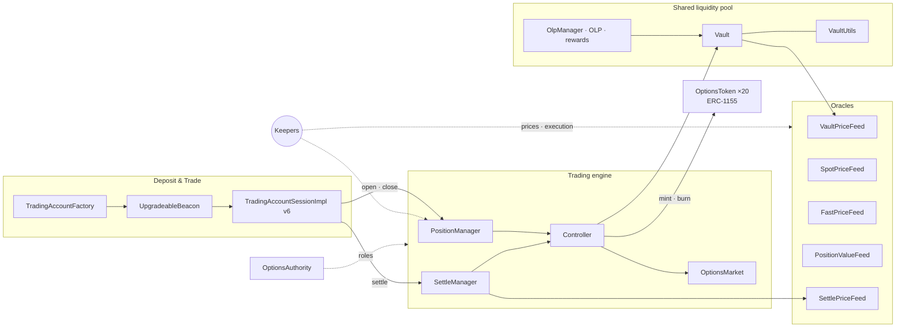

<div align="center">

# CallPut

**On-chain options on crypto and real-world assets — Robinhood Chain contracts**

[](https://robinhoodchain.blockscout.com)
[](#build)
[](deployments/source-verification.json)
[](LICENSE)

[Website](https://robin.callput.app) · [Docs](https://docs.callput.app) · [X](https://x.com/CallPutApp)

[Status](#implementation-and-deployment-status) · [Addresses](#deployed-addresses) · [Manifest](deployments/robinhood-mainnet.json) · [Reproduce](#how-to-reproduce)

</div>

CallPut is an options protocol where **every position is a token**. A trader
buys or sells a call, a put or a complete vertical spread, and receives a single
ERC-1155 token whose ID encodes the full contract: underlying, expiry, strategy
and every leg's strike and side. A shared liquidity vault underwrites the other
side, fully collateralized, and pays out in USDG at expiry.

This repository contains the Solidity source, build configuration and verified
deployment for **Robinhood Chain mainnet**. Contracts cover **BTC, ETH, 14 stocks
and 4 ETFs**, with **Paxos USDG** as the deposit and settlement asset. Core designs
are shared with CallPut on Base; deployments and operating settings are separate.

## Implementation and deployment status

Read-only checks on **2026-10-05 KST** (2026-10-04 15:38 UTC), at Robinhood block
[80047504](https://robinhoodchain.blockscout.com/block/80047504), confirmed the
account policy and market bindings below. The app and its public market-data
endpoint also responded; no funded user transaction was submitted for this check.

### Implemented and deployed

| Area | Scope / checked state |
| --- | --- |
| Contracts and verification | Core protocol, liquidity pool and account v6 deployed. The [verification report](deployments/source-verification.json) records all 110 deployment addresses as source-verified on 2026-10-01. |
| Deposit & Trade | Account creation, USDG deposits, owner-authorized withdrawals and scoped session trading implemented. Public trading admission is enabled (`openToAll = true`, `safeMode = false`). |
| Open, close and settle | Four vertical-spread strategies enabled (`allowedStrategiesMask = 0x1e0`); ERC-1155 positions support early close and expiry settlement. |
| Asset deployment and listing | **20 OptionsTokens deployed; all 20 underlyings registered and active.** Every market mapping matches the manifest and every OptionsToken authorizes the Controller. |
| Application and market data | [Robinhood app](https://robin.callput.app) deployed; [market data](https://app-data-robinhood.s3.ap-southeast-1.amazonaws.com/market-data.json) publishes all 20 assets. The app uses separately operated relay, keeper and indexing services. |
| Liquidity | The liquidity pool is funded: approximately 9,999 USDG in `poolAmounts` at the checked block. This is pool accounting, not a guarantee of available capacity for an order. |

### Not enabled, pending or outside this repository

| Area | Limitation / remaining work |
| --- | --- |
| Additional strategies | Single-leg strategies are disabled. Four-leg token encoding does not imply butterfly/condor trading is implemented. |
| Rewards and referrals UI | The on-chain Referral contract is deployed; the Rewards interface and redesigned points program are not launched. |
| Full-stack reproduction | This is a contract-only repository: no frontend, relay/keeper services or automated end-to-end trading runner is included. Use the hosted app for the manual flow below. |
| Funded end-to-end verification | Build, deployment and read-only checks are documented. A complete funded deposit → open → close/settle → withdrawal was not performed for this README update. |

**Historical records:** the [manifest](deployments/robinhood-mainnet.json),
[source metadata](SOURCE.json) and [bootstrap record](docs/robinhood-mainnet-deployment.md)
describe the 2026-10-01 contract bootstrap. Their closed-admission and unlisted-stock
labels predate the service rollout; they are not the current market state.
Deployment, market activation and the ability to fill an order are separate:
trading also depends on market hours, a valid expiry, fresh prices and pool capacity.

## Highlights

| | |
| --- | --- |
| **Strategies as tokens** | A vertical spread is one token, not two loose legs. The 256-bit token ID is the full term sheet. See [Option tokens](#option-tokens). |
| **Real-world asset options** | Call and put spreads on equities and ETFs (NVDA, TSLA, AAPL, SPY, QQQ …) next to BTC and ETH. |
| **Fully collateralized** | The maximum payout is reserved in the vault when a position opens. Spreads cap the loss on both sides. |
| **Pooled liquidity** | LPs underwrite options through one shared USDG liquidity pool and earn premiums and fees. |
| **Self-custodial one-click trading** | Each user gets a smart trading account with scoped session keys. Only the owner can withdraw. |
| **Verifiable** | Source, compiler settings and address-by-address Blockscout verification for the 110 published deployment addresses. |

## Options underlyings — 20 assets

**BTC · ETH · 14 stocks · 4 ETFs** — all 20 have deployed option-token contracts
and active market registration at the checked block. Available expiries and
quotes are shown in the app; stock/ETF trading follows configured market hours.

| Category | Underlyings |
| --- | --- |
| Crypto | **BTC, ETH** |
| Stocks | **AAPL, AMZN, COIN, CRCL, GOOGL, META, MSFT, MU, NVDA, PLTR, SKHY, SNDK, SPCX, TSLA** |
| ETFs | **DRAM, EWY, QQQ, SPY** |

Each underlying has its own `OptionsToken` contract. Stock and ETF underlyings
are price identifiers; options on them are cash-settled in USDG, so no tokenized
share custody is involved.

## Option tokens

A CallPut position is an [`OptionsToken`](contracts/tokens/OptionsToken.sol)
(ERC-1155) balance. The token ID is built by
[`Utils.formatOptionTokenId`](contracts/Utils.sol) and packs the whole
instrument into 256 bits:

| Bits | Field | Width |
| --- | --- | --- |
| 255 – 240 | Underlying asset index | 16 |
| 239 – 200 | Expiry (Unix seconds) | 40 |
| 199 – 196 | Strategy | 4 |
| 195 – 194 | Leg count − 1 | 2 |
| 193 – 146 | Leg 1: `isBuy` · strike · `isCall` | 1 + 46 + 1 |
| 145 – 98 | Leg 2 | 48 |
| 97 – 50 | Leg 3 | 48 |
| 49 – 2 | Leg 4 | 48 |
| 1 – 0 | Vault index | 2 |

Any contract, indexer or wallet can read the terms straight from the ID:

```solidity
(
    uint16 underlyingAssetIndex,
    uint40 expiry,
    Utils.Strategy strategy,
    uint8 legs,
    bool[4] memory isBuys,
    uint48[4] memory strikePrices,
    bool[4] memory isCalls,
    uint8 vaultIndex
) = Utils.parseOptionTokenId(optionTokenId);
```

### Supported strategies

| ID | Strategy | Legs | Enabled on Robinhood |
| --- | --- | --- | --- |
| 1 – 4 | Buy Call · Sell Call · Buy Put · Sell Put | 1 | — |
| 5 | Buy Call Spread | 2 | ✓ |
| 6 | Sell Call Spread | 2 | ✓ |
| 7 | Buy Put Spread | 2 | ✓ |
| 8 | Sell Put Spread | 2 | ✓ |

Strategies are switched on by a bitmask in `Controller`. Robinhood is configured
with the four vertical spreads (`allowedStrategiesMask = 0x1e0`), so every position
has a defined maximum loss and a defined maximum payout.

### Design properties

- **One token per strategy.** Both legs of a spread live in one ID, so a spread is
  opened, transferred, closed and settled as one unit.
- **Canonical.** Legs are sorted by strike before encoding. The same strategy
  always produces the same ID, and positions from different traders are fungible.
- **Mirrored.** On every open the trader receives the ID and the vault receives
  its mirror — the same ID with each leg's `isBuy` bit flipped. When a vault
  ends up holding both sides of an ID, keepers net them through `Controller`
  and the reserved collateral is released.
- **Bearer instrument.** Close and settlement act on the caller's own token
  balance. Whoever holds the token owns the payoff. Positions move with a
  standard ERC-1155 transfer: to another wallet, through OTC or on any
  ERC-1155 marketplace.
- **Room to grow.** The format has four leg slots and a 16-value strategy field
  (eight defined). Additional multi-leg strategies would still need strategy
  recognition, pricing, risk checks and activation; they are not enabled today.

## How a trade works

The diagram describes the contract flow. Follow [How to reproduce](#how-to-reproduce)
for reviewer prerequisites, app steps and expected results.



Execution price is the oracle mark price plus a risk premium when buying, or
minus it when selling. Premiums paid into a vault are released to LPs over time
rather than all at once.

## Architecture



| Module | Key contracts | Responsibility |
| --- | --- | --- |
| Trading accounts | `TradingAccountFactory`, `TradingAccountSessionImpl` | Account creation, custody, owner withdrawals and session trading |
| Options market | `OptionsMarket`, `PositionManager`, `Controller` | Markets, order execution and position accounting |
| Liquidity | `Vault`, `VaultUtils`, `OlpManager` | Shared liquidity pool and liquidity management |
| Settlement | `SettleManager`, `SettlePriceFeed` | Expiry settlement and settlement prices |
| Pricing | `SpotPriceFeed`, `FastPriceFeed`, `VaultPriceFeed`, `PositionValueFeed` | Price inputs and option valuation |
| Tokens and rewards | `OptionsToken`, `USDG`, `OLP`, reward contracts | ERC-1155 positions, pool accounting, LP tokens and rewards |
| Permissions | `OptionsAuthority`, `ProxyAdmin` | Core roles and proxy upgrade administration |
| Referrals and reads | `Referral`, `ViewAggregator` | Referral relationships and aggregated protocol data |

Core contracts use OpenZeppelin transparent proxies (EIP-1967). Trading accounts
use beacon proxies created by a non-upgradeable factory.

### Deposit & Trade

Each owner has a smart trading account that holds USDG and option tokens. The
owner signs an EIP-712 **session grant** once; the session key can then trade
without a wallet prompt per order, strictly inside the grant:

| Grant limit | Scope |
| --- | --- |
| Time window | `validAfter` – `validUntil` |
| Markets and strategies | Allowed underlyings and a strategy bitmask |
| Spend | Per-open and total spend caps; maximum opens and closes |
| Fees | Per-trade and total fee caps |
| Revocation | Per-session revoke or an epoch bump that invalidates every session |

Session keys cannot withdraw. Withdrawals of USDG or option tokens always
require the owner. Referrals are registered by the trading account. The factory
controls account admission and beacon upgrades; the beacon points to account
implementation **v6**.

The current app exposes one trading account per connected wallet. The factory's
registered-account limit is **10 per owner** at the checked block; additional
account creation and switching are not exposed in the app.

## Robinhood mainnet

| Setting | Value |
| --- | --- |
| Chain ID | `4663` |
| Explorer | [Robinhood Chain Blockscout](https://robinhoodchain.blockscout.com) |
| Public RPC | `https://rpc.mainnet.chain.robinhood.com` |
| Gas token | ETH |
| Settlement asset | Paxos USDG (6 decimals) |
| Enabled strategies | Buy/Sell Call Spread, Buy/Sell Put Spread |
| Underlyings | 20 deployed and registered: BTC, ETH, 14 stocks, 4 ETFs |
| Account access | Public trading admission enabled at the checked block; owner authorization and funded-account registration still required |

## Deployed addresses

Addresses and implementation links below come from the
[mainnet deployment manifest](deployments/robinhood-mainnet.json).
The tables below cover contracts used by the current service. The manifest
retains the complete deployment inventory, including legacy contracts.
For transparent proxies, integrations use the **Address** column;
**Implementation** links point to the underlying logic contract. Multiple
proxies of the same type can share an implementation.

All listed CallPut contracts are source-verified on Blockscout. See the
[verified implementation list](#verified-implementations) below.

### Trading accounts

| Contract | Address (explorer) | Role |
| --- | --- | --- |
| TradingAccountFactory | [`0xbcaC622Bb396B2f868b37D7C41F34695c9be1862`](https://robinhoodchain.blockscout.com/address/0xbcaC622Bb396B2f868b37D7C41F34695c9be1862) | Account creation, registry and administration |
| UpgradeableBeacon | [`0x5685d4DD5114c74C805322d4612CA5D73EAcdc62`](https://robinhoodchain.blockscout.com/address/0x5685d4DD5114c74C805322d4612CA5D73EAcdc62) | Shared account implementation; owned by the factory |
| TradingAccountSessionImpl | [`0x2436A7575cf8A3289c7A07154f89f05660756312`](https://robinhoodchain.blockscout.com/address/0x2436A7575cf8A3289c7A07154f89f05660756312) | Account implementation v6 |

These are the factory, beacon and implementation contracts. Individual trading
account addresses are created through the factory.

### Core protocol

| Contract | Address (explorer) | Implementation |
| --- | --- | --- |
| OptionsMarket | [`0x3271d35afAc70C0D4989F984Abb2d918bf672C7e`](https://robinhoodchain.blockscout.com/address/0x3271d35afAc70C0D4989F984Abb2d918bf672C7e) | [impl](https://robinhoodchain.blockscout.com/address/0x100291F9Fc52CE39e177DfD6d4bC72aDF906A1d9#code) |
| Controller | [`0x0D240c1EbEeE7F74B40d6611326f5df98AB00e1B`](https://robinhoodchain.blockscout.com/address/0x0D240c1EbEeE7F74B40d6611326f5df98AB00e1B) | [impl](https://robinhoodchain.blockscout.com/address/0x66C1F85b71eCA648E27B860213676f9116f5eE9A#code) |
| PositionManager | [`0x426a6b482893557E58cF38de635fEbB30Fd6a3C3`](https://robinhoodchain.blockscout.com/address/0x426a6b482893557E58cF38de635fEbB30Fd6a3C3) | [impl](https://robinhoodchain.blockscout.com/address/0x9D83c9f0581a695c5D1fbD7B41EB8ddc5143246D#code) |
| SettleManager | [`0xd328D581f3Fb1Ca86D28D573bA1f17409e5112EF`](https://robinhoodchain.blockscout.com/address/0xd328D581f3Fb1Ca86D28D573bA1f17409e5112EF) | [impl](https://robinhoodchain.blockscout.com/address/0x7B968a70467C1dc0553B84E0Fd7ef25c7B357A25#code) |
| OptionsAuthority | [`0x85e00a193d5E340339484336dd9EA09f942A0b7B`](https://robinhoodchain.blockscout.com/address/0x85e00a193d5E340339484336dd9EA09f942A0b7B) | [impl](https://robinhoodchain.blockscout.com/address/0x8B4290fffB0700ee1618BBbA88299449E92fD022#code) |
| ViewAggregator | [`0xf277D41cc8093667bf1A023f4FBbeB8328900bb7`](https://robinhoodchain.blockscout.com/address/0xf277D41cc8093667bf1A023f4FBbeB8328900bb7) | [impl](https://robinhoodchain.blockscout.com/address/0x3E52762fAE476de0F70fE241f188dbAE0c90C2c8#code) |
| Referral | [`0xBa64c819A8C5a80E51ce5f929C3BF08DD187D6c9`](https://robinhoodchain.blockscout.com/address/0xBa64c819A8C5a80E51ce5f929C3BF08DD187D6c9) | [impl](https://robinhoodchain.blockscout.com/address/0x51B48222a31413F1FD58C18Aa13b51c35020cB9c#code) |
| FeeDistributor | [`0x42260a98bc6e1AA2f4CEC5508146d713BfD72c41`](https://robinhoodchain.blockscout.com/address/0x42260a98bc6e1AA2f4CEC5508146d713BfD72c41) | [impl](https://robinhoodchain.blockscout.com/address/0x9D441286DCf5e6aaE87706d88bc6Fa772D18847F#code) |

### Liquidity pool

| Contract | Address (explorer) | Implementation |
| --- | --- | --- |
| Vault | [`0x21bA39e9394657A6196f6948C2701D9fD9612289`](https://robinhoodchain.blockscout.com/address/0x21bA39e9394657A6196f6948C2701D9fD9612289) | [impl](https://robinhoodchain.blockscout.com/address/0x9954964Af61DC7Ba9e82B7A7C5A6bF7caB54358d#code) |
| VaultUtils | [`0xfB970601A11254bA465fE52eC88546299E1E002c`](https://robinhoodchain.blockscout.com/address/0xfB970601A11254bA465fE52eC88546299E1E002c) | [impl](https://robinhoodchain.blockscout.com/address/0xdc813f312ce0f92C69C996cD6Df53cb90d41b7c7#code) |
| OlpManager | [`0xbed7fB763bb9391e45AD2c70FE19887CAD7Ec9B8`](https://robinhoodchain.blockscout.com/address/0xbed7fB763bb9391e45AD2c70FE19887CAD7Ec9B8) | [impl](https://robinhoodchain.blockscout.com/address/0x4eD46e1df37dbfE9B0D31137a912e78D997f72Dc#code) |

The service uses one pool: the vault and its accounting, LP and reward contracts
use the `S_` keys in the deployment manifest.

### Oracles

| Contract | Address (explorer) | Implementation |
| --- | --- | --- |
| VaultPriceFeed | [`0x2666ce652b1929D4F5a2dBBf094E5DfD38d1b9f1`](https://robinhoodchain.blockscout.com/address/0x2666ce652b1929D4F5a2dBBf094E5DfD38d1b9f1) | [impl](https://robinhoodchain.blockscout.com/address/0x5f549AAbE9586224988F23FE88f5f15a23224bf3#code) |
| SpotPriceFeed | [`0x2318040e26791777d675cFeF87FE25BDcE36439A`](https://robinhoodchain.blockscout.com/address/0x2318040e26791777d675cFeF87FE25BDcE36439A) | [impl](https://robinhoodchain.blockscout.com/address/0xd2BCAB3d76600e61c64FDba6726D495F1B6B92CB#code) |
| FastPriceFeed | [`0xA936FCaD3C5CDda9106F72499729877E9dF5918a`](https://robinhoodchain.blockscout.com/address/0xA936FCaD3C5CDda9106F72499729877E9dF5918a) | [impl](https://robinhoodchain.blockscout.com/address/0x479B6Bf0A40c5359C68352B91e504977Ae65D7DC#code) |
| FastPriceEvents | [`0x1e5A834eb298288E28C07b6f2369e0008a5d156C`](https://robinhoodchain.blockscout.com/address/0x1e5A834eb298288E28C07b6f2369e0008a5d156C) | [impl](https://robinhoodchain.blockscout.com/address/0x049D3b6455a5E393a3C0761CfCFE75ff2221cbb6#code) |
| SettlePriceFeed | [`0xB51EC03d51e8880FDc2A24f918072694516FB626`](https://robinhoodchain.blockscout.com/address/0xB51EC03d51e8880FDc2A24f918072694516FB626) | [impl](https://robinhoodchain.blockscout.com/address/0xfe3F5FF9e740AeD8213dc6327E1DdC13718D6702#code) |
| PositionValueFeed | [`0x32847298142A9E692EfE1c259aADe4f260bDe94C`](https://robinhoodchain.blockscout.com/address/0x32847298142A9E692EfE1c259aADe4f260bDe94C) | [impl](https://robinhoodchain.blockscout.com/address/0x60Acd6ca57b279065D8629d091cCEb891C5751F4#code) |
| PrimaryOracle | [`0x9D1e3c557F3E3078dCBd8ac77Dfe1950db9B8c0B`](https://robinhoodchain.blockscout.com/address/0x9D1e3c557F3E3078dCBd8ac77Dfe1950db9B8c0B) | [impl](https://robinhoodchain.blockscout.com/address/0x66cAAcF4F6635b553B2Ff984DCA1877c0fDAD324#code) |

### Protocol tokens

| Contract | Address (explorer) | Implementation |
| --- | --- | --- |
| OptionsToken — BTC | [`0x080084D6A1e9b6657EDc8DBa071BAa9D15Fcc500`](https://robinhoodchain.blockscout.com/address/0x080084D6A1e9b6657EDc8DBa071BAa9D15Fcc500) | [impl](https://robinhoodchain.blockscout.com/address/0x8ba18F54908852A798BC8e1aB28235FfeeD5DFc9#code) |
| OptionsToken — ETH | [`0x84D4ef4062E00F78B0Ea5aaC06D7D08Ab1258B02`](https://robinhoodchain.blockscout.com/address/0x84D4ef4062E00F78B0Ea5aaC06D7D08Ab1258B02) | [impl](https://robinhoodchain.blockscout.com/address/0x8ba18F54908852A798BC8e1aB28235FfeeD5DFc9#code) |
| USDG | [`0xb4193D3618E45231A3D4a73600170ef5cbF62E0F`](https://robinhoodchain.blockscout.com/address/0xb4193D3618E45231A3D4a73600170ef5cbF62E0F) | [impl](https://robinhoodchain.blockscout.com/address/0x355E932F8ED363cC3E3d7AB4F326F8553360229a#code) |
| OLP | [`0x463811B783f53c7adf01Bc51aFb7880b6d95A5d5`](https://robinhoodchain.blockscout.com/address/0x463811B783f53c7adf01Bc51aFb7880b6d95A5d5) | [impl](https://robinhoodchain.blockscout.com/address/0x67FCdaB641Ab053DB3bcA63dC4d8ee5c12260706#code) |

`OptionsToken` is ERC-1155. The internal `S_USDG` token uses 18 decimals for
vault accounting; `S_OLP` represents liquidity in the service pool.

<details>
<summary>Reward and liquidity queue contracts</summary>

| Contract | Address (explorer) | Implementation |
| --- | --- | --- |
| RewardTracker | [`0x6b8979E1662a1e7524ecBBA625AA31cf87247Ea5`](https://robinhoodchain.blockscout.com/address/0x6b8979E1662a1e7524ecBBA625AA31cf87247Ea5) | [impl](https://robinhoodchain.blockscout.com/address/0x79AD98fA252D64A9095f83cc6FaF4243E0d01d48#code) |
| RewardDistributor | [`0xD339d220bb30603e66cf15394657C9cAaC97274E`](https://robinhoodchain.blockscout.com/address/0xD339d220bb30603e66cf15394657C9cAaC97274E) | [impl](https://robinhoodchain.blockscout.com/address/0x6090cd3cb1c8d46471A600f363237D0E3b4388cb#code) |
| RewardRouterV2 | [`0x0BA1292c9e205c0a12d926406b0ab5bc3EF879f0`](https://robinhoodchain.blockscout.com/address/0x0BA1292c9e205c0a12d926406b0ab5bc3EF879f0) | [impl](https://robinhoodchain.blockscout.com/address/0x306Da5cfa8640a989684432f5b2BC9a27E216E80#code) |
| OlpQueue | [`0xFC121FEaAAf0bEdc93E5Da7a9C7D161357C89e16`](https://robinhoodchain.blockscout.com/address/0xFC121FEaAAf0bEdc93E5Da7a9C7D161357C89e16) | [impl](https://robinhoodchain.blockscout.com/address/0xD959B771c5244d290072cD319FDdFe6aa7b2Ad66#code) |

</details>

### Stock & ETF underlyings (18)

Each underlying is a zero-supply ERC-20 identifier with a matching `OptionsToken`
proxy, reusing the BTC/ETH OptionsToken implementation. The underlying tokens
are protocol identifiers; they do not represent ownership of shares or ETF units.
The 18 pairs were initially predeployed, then registered and activated during
the service rollout. See [current status](#implementation-and-deployment-status).

| Underlying | Underlying address | OptionsToken address |
| --- | --- | --- |
| TSLA | [`0x2e3827D35687e4D2c7DD94fce14E6D6fEAfD873d`](https://robinhoodchain.blockscout.com/address/0x2e3827D35687e4D2c7DD94fce14E6D6fEAfD873d) | [`0x9C007762CBf1ABF0Bb3e1C67660023bD3Ad1734D`](https://robinhoodchain.blockscout.com/address/0x9C007762CBf1ABF0Bb3e1C67660023bD3Ad1734D) |
| QQQ | [`0x2d4a28f9d7Fa0754B9E6a4e768891AA5AE5CAee1`](https://robinhoodchain.blockscout.com/address/0x2d4a28f9d7Fa0754B9E6a4e768891AA5AE5CAee1) | [`0x951D61C56CC4c3b79CF7078C371C474917480FDd`](https://robinhoodchain.blockscout.com/address/0x951D61C56CC4c3b79CF7078C371C474917480FDd) |
| SPY | [`0xD552a5358908e3B30439D925ca1F1fCe5Ab009F7`](https://robinhoodchain.blockscout.com/address/0xD552a5358908e3B30439D925ca1F1fCe5Ab009F7) | [`0x334D4fbf590Cbc3553fBdd6f11a2C0d7C1221e8A`](https://robinhoodchain.blockscout.com/address/0x334D4fbf590Cbc3553fBdd6f11a2C0d7C1221e8A) |
| EWY | [`0xAe8fedfa2BAbF1792854429d6040799062E075EE`](https://robinhoodchain.blockscout.com/address/0xAe8fedfa2BAbF1792854429d6040799062E075EE) | [`0x35D2Cd90b6Ba62ea33F38A711DbB99C6C3D81Ba7`](https://robinhoodchain.blockscout.com/address/0x35D2Cd90b6Ba62ea33F38A711DbB99C6C3D81Ba7) |
| NVDA | [`0x894AB41c5353eB9795FFC44B412628eE1b2197FB`](https://robinhoodchain.blockscout.com/address/0x894AB41c5353eB9795FFC44B412628eE1b2197FB) | [`0xcA2bc103CD18EC0b7646969dcB383D64037cb5bB`](https://robinhoodchain.blockscout.com/address/0xcA2bc103CD18EC0b7646969dcB383D64037cb5bB) |
| COIN | [`0x04D773Cc8C88895FA29380a09E90613bFABEB4D4`](https://robinhoodchain.blockscout.com/address/0x04D773Cc8C88895FA29380a09E90613bFABEB4D4) | [`0x48E93EbC08ccaa3D3fC9E388bfEfD8209922D1cb`](https://robinhoodchain.blockscout.com/address/0x48E93EbC08ccaa3D3fC9E388bfEfD8209922D1cb) |
| SPCX | [`0x973533762B5F0Fa16B15854A54a920Ce7560e926`](https://robinhoodchain.blockscout.com/address/0x973533762B5F0Fa16B15854A54a920Ce7560e926) | [`0x0EAe421365011aE66dfa8bb9D1E8Baee54e5402d`](https://robinhoodchain.blockscout.com/address/0x0EAe421365011aE66dfa8bb9D1E8Baee54e5402d) |
| MU | [`0xB694AC94B1f0C22013B66AF948A7F02E7Ed64daa`](https://robinhoodchain.blockscout.com/address/0xB694AC94B1f0C22013B66AF948A7F02E7Ed64daa) | [`0x1868dB80a42E6D303E3A961886ba4534b6f56d40`](https://robinhoodchain.blockscout.com/address/0x1868dB80a42E6D303E3A961886ba4534b6f56d40) |
| SKHY | [`0x53FFa4E63165fc7ed5390e02277e4c0e36336c50`](https://robinhoodchain.blockscout.com/address/0x53FFa4E63165fc7ed5390e02277e4c0e36336c50) | [`0x0a750ABB292C902D9752C5f508Ec6f5ec9Be7FCd`](https://robinhoodchain.blockscout.com/address/0x0a750ABB292C902D9752C5f508Ec6f5ec9Be7FCd) |
| SNDK | [`0x467be03f40beE63606Ad208a100Fb14B5e9b7bFE`](https://robinhoodchain.blockscout.com/address/0x467be03f40beE63606Ad208a100Fb14B5e9b7bFE) | [`0x5dBd79079fc1abA28F0a270beEcD855aCda98c88`](https://robinhoodchain.blockscout.com/address/0x5dBd79079fc1abA28F0a270beEcD855aCda98c88) |
| DRAM | [`0x9e5B63e8Dc02576A31b88DA04A14C5282D7a5bfd`](https://robinhoodchain.blockscout.com/address/0x9e5B63e8Dc02576A31b88DA04A14C5282D7a5bfd) | [`0xC3827d938c96232b3a08E83D71D084965Eb7e3Fb`](https://robinhoodchain.blockscout.com/address/0xC3827d938c96232b3a08E83D71D084965Eb7e3Fb) |
| META | [`0x126e5CdBc6D04880D7b17E1FC7bF44a39279d419`](https://robinhoodchain.blockscout.com/address/0x126e5CdBc6D04880D7b17E1FC7bF44a39279d419) | [`0x778d648c02c8F521bE22f903Fd2edb8bD6F34DFB`](https://robinhoodchain.blockscout.com/address/0x778d648c02c8F521bE22f903Fd2edb8bD6F34DFB) |
| GOOGL | [`0xB00bC91af828AA279100b1D482aD4C07F80078b9`](https://robinhoodchain.blockscout.com/address/0xB00bC91af828AA279100b1D482aD4C07F80078b9) | [`0x84d0040153e67618D49C49EDb3f50e6Ed8de0d7D`](https://robinhoodchain.blockscout.com/address/0x84d0040153e67618D49C49EDb3f50e6Ed8de0d7D) |
| AAPL | [`0x08817cf3D786d36b56bFa1fc5F71273314468fb1`](https://robinhoodchain.blockscout.com/address/0x08817cf3D786d36b56bFa1fc5F71273314468fb1) | [`0xCa103C4D4bb8CEf8bf3A8622b0a3fCA58d835118`](https://robinhoodchain.blockscout.com/address/0xCa103C4D4bb8CEf8bf3A8622b0a3fCA58d835118) |
| CRCL | [`0x8d210Af1Ec489310c0A74d6eAa0cfa471F9De6cC`](https://robinhoodchain.blockscout.com/address/0x8d210Af1Ec489310c0A74d6eAa0cfa471F9De6cC) | [`0x4A87676cbF3d0e725aeF3DaF8962Ea805Dda569e`](https://robinhoodchain.blockscout.com/address/0x4A87676cbF3d0e725aeF3DaF8962Ea805Dda569e) |
| AMZN | [`0x0Af16c8F8731FB9c0b8d4851e1509130CFbe5f68`](https://robinhoodchain.blockscout.com/address/0x0Af16c8F8731FB9c0b8d4851e1509130CFbe5f68) | [`0x53a0B4cB036BeCE074194171B3A6f885276d61C3`](https://robinhoodchain.blockscout.com/address/0x53a0B4cB036BeCE074194171B3A6f885276d61C3) |
| MSFT | [`0x3cD315EEf182EF06e0d12f4396AC50035AB4F211`](https://robinhoodchain.blockscout.com/address/0x3cD315EEf182EF06e0d12f4396AC50035AB4F211) | [`0x9AA5a975b26432730173AEeAa20E9DD1C999Ee99`](https://robinhoodchain.blockscout.com/address/0x9AA5a975b26432730173AEeAa20E9DD1C999Ee99) |
| PLTR | [`0x2d7a46adE1FE818D3D00A915D7f38938AE0fb404`](https://robinhoodchain.blockscout.com/address/0x2d7a46adE1FE818D3D00A915D7f38938AE0fb404) | [`0x3DbD73E6BE453E79D28968503bb88c6c5f7d12BA`](https://robinhoodchain.blockscout.com/address/0x3DbD73E6BE453E79D28968503bb88c6c5f7d12BA) |

### External assets

These token contracts already exist on Robinhood Chain.

| Asset | Address (explorer) | Decimals | Role |
| --- | --- | --- | --- |
| Paxos USDG | [`0x5fc5360D0400a0Fd4f2af552ADD042D716F1d168`](https://robinhoodchain.blockscout.com/address/0x5fc5360D0400a0Fd4f2af552ADD042D716F1d168) | 6 | Deposits, trading collateral and withdrawals |
| WBTC | [`0x6bac06600D220Ac5Ac281AD1f504D2Cf0F90F6e6`](https://robinhoodchain.blockscout.com/address/0x6bac06600D220Ac5Ac281AD1f504D2Cf0F90F6e6) | 8 | BTC underlying asset |
| WETH | [`0x0Bd7D308f8E1639FAb988df18A8011f41EAcAD73`](https://robinhoodchain.blockscout.com/address/0x0Bd7D308f8E1639FAb988df18A8011f41EAcAD73) | 18 | ETH underlying asset |

**Paxos USDG is separate from CallPut's internal USDG accounting tokens.** The
existing ABI names `USDC` and `core.usdc` reference Paxos USDG on this chain.

## Verification

| Check | Status |
| --- | --- |
| Standalone compilation | Passed with the settings above |
| Deployment receipts and runtime code | Passed; bootstrap, oracle upgrade and 18 stock pairs |
| Account v6, factory/beacon wiring and admin/keeper roles | Passed |
| Source verification | **110 addresses:** 110 on Blockscout |

Application implementation bytecode matches the standalone build, with immutable
bindings checked on-chain. Transparent proxy and ProxyAdmin shells match the
deployment plugin's bundled OpenZeppelin artifacts
(`@openzeppelin/upgrades-core` `1.40.0`).

All 110 deployed addresses, including proxy shells and the superseded oracle
implementation, are fully source-verified on **Blockscout**.
See the [address-by-address results](deployments/source-verification.json).

See the [deployment verification record](docs/robinhood-mainnet-deployment.md)
for transaction records, runtime hashes and the scope of completed checks.

### Verified implementations

The **26 unique current implementations** are listed below. Multiple proxies can
share one implementation; all 20 OptionsTokens share the same ERC-1155 logic.
`TradingAccountSessionImpl` v6 is the implementation configured in the trading
account beacon.

| # | Contract | Verified implementation |
| --- | --- | --- |
| 1 | OptionsMarket | [`0x100291F9Fc52CE39e177DfD6d4bC72aDF906A1d9`](https://robinhoodchain.blockscout.com/address/0x100291F9Fc52CE39e177DfD6d4bC72aDF906A1d9#code) |
| 2 | Vault | [`0x9954964Af61DC7Ba9e82B7A7C5A6bF7caB54358d`](https://robinhoodchain.blockscout.com/address/0x9954964Af61DC7Ba9e82B7A7C5A6bF7caB54358d#code) |
| 3 | VaultUtils | [`0xdc813f312ce0f92C69C996cD6Df53cb90d41b7c7`](https://robinhoodchain.blockscout.com/address/0xdc813f312ce0f92C69C996cD6Df53cb90d41b7c7#code) |
| 4 | PositionManager | [`0x9D83c9f0581a695c5D1fbD7B41EB8ddc5143246D`](https://robinhoodchain.blockscout.com/address/0x9D83c9f0581a695c5D1fbD7B41EB8ddc5143246D#code) |
| 5 | SettleManager | [`0x7B968a70467C1dc0553B84E0Fd7ef25c7B357A25`](https://robinhoodchain.blockscout.com/address/0x7B968a70467C1dc0553B84E0Fd7ef25c7B357A25#code) |
| 6 | Controller | [`0x66C1F85b71eCA648E27B860213676f9116f5eE9A`](https://robinhoodchain.blockscout.com/address/0x66C1F85b71eCA648E27B860213676f9116f5eE9A#code) |
| 7 | OptionsAuthority | [`0x8B4290fffB0700ee1618BBbA88299449E92fD022`](https://robinhoodchain.blockscout.com/address/0x8B4290fffB0700ee1618BBbA88299449E92fD022#code) |
| 8 | VaultPriceFeed | [`0x5f549AAbE9586224988F23FE88f5f15a23224bf3`](https://robinhoodchain.blockscout.com/address/0x5f549AAbE9586224988F23FE88f5f15a23224bf3#code) |
| 9 | FastPriceFeed | [`0x479B6Bf0A40c5359C68352B91e504977Ae65D7DC`](https://robinhoodchain.blockscout.com/address/0x479B6Bf0A40c5359C68352B91e504977Ae65D7DC#code) |
| 10 | PositionValueFeed | [`0x60Acd6ca57b279065D8629d091cCEb891C5751F4`](https://robinhoodchain.blockscout.com/address/0x60Acd6ca57b279065D8629d091cCEb891C5751F4#code) |
| 11 | SettlePriceFeed | [`0xfe3F5FF9e740AeD8213dc6327E1DdC13718D6702`](https://robinhoodchain.blockscout.com/address/0xfe3F5FF9e740AeD8213dc6327E1DdC13718D6702#code) |
| 12 | SpotPriceFeed | [`0xd2BCAB3d76600e61c64FDba6726D495F1B6B92CB`](https://robinhoodchain.blockscout.com/address/0xd2BCAB3d76600e61c64FDba6726D495F1B6B92CB#code) |
| 13 | PrimaryOracle | [`0x66cAAcF4F6635b553B2Ff984DCA1877c0fDAD324`](https://robinhoodchain.blockscout.com/address/0x66cAAcF4F6635b553B2Ff984DCA1877c0fDAD324#code) |
| 14 | ViewAggregator | [`0x3E52762fAE476de0F70fE241f188dbAE0c90C2c8`](https://robinhoodchain.blockscout.com/address/0x3E52762fAE476de0F70fE241f188dbAE0c90C2c8#code) |
| 15 | OlpManager | [`0x4eD46e1df37dbfE9B0D31137a912e78D997f72Dc`](https://robinhoodchain.blockscout.com/address/0x4eD46e1df37dbfE9B0D31137a912e78D997f72Dc#code) |
| 16 | OptionsToken | [`0x8ba18F54908852A798BC8e1aB28235FfeeD5DFc9`](https://robinhoodchain.blockscout.com/address/0x8ba18F54908852A798BC8e1aB28235FfeeD5DFc9#code) |
| 17 | FastPriceEvents | [`0x049D3b6455a5E393a3C0761CfCFE75ff2221cbb6`](https://robinhoodchain.blockscout.com/address/0x049D3b6455a5E393a3C0761CfCFE75ff2221cbb6#code) |
| 18 | Referral | [`0x51B48222a31413F1FD58C18Aa13b51c35020cB9c`](https://robinhoodchain.blockscout.com/address/0x51B48222a31413F1FD58C18Aa13b51c35020cB9c#code) |
| 19 | FeeDistributor | [`0x9D441286DCf5e6aaE87706d88bc6Fa772D18847F`](https://robinhoodchain.blockscout.com/address/0x9D441286DCf5e6aaE87706d88bc6Fa772D18847F#code) |
| 20 | USDG | [`0x355E932F8ED363cC3E3d7AB4F326F8553360229a`](https://robinhoodchain.blockscout.com/address/0x355E932F8ED363cC3E3d7AB4F326F8553360229a#code) |
| 21 | OLP | [`0x67FCdaB641Ab053DB3bcA63dC4d8ee5c12260706`](https://robinhoodchain.blockscout.com/address/0x67FCdaB641Ab053DB3bcA63dC4d8ee5c12260706#code) |
| 22 | RewardTracker | [`0x79AD98fA252D64A9095f83cc6FaF4243E0d01d48`](https://robinhoodchain.blockscout.com/address/0x79AD98fA252D64A9095f83cc6FaF4243E0d01d48#code) |
| 23 | RewardDistributor | [`0x6090cd3cb1c8d46471A600f363237D0E3b4388cb`](https://robinhoodchain.blockscout.com/address/0x6090cd3cb1c8d46471A600f363237D0E3b4388cb#code) |
| 24 | RewardRouterV2 | [`0x306Da5cfa8640a989684432f5b2BC9a27E216E80`](https://robinhoodchain.blockscout.com/address/0x306Da5cfa8640a989684432f5b2BC9a27E216E80#code) |
| 25 | OlpQueue | [`0xD959B771c5244d290072cD319FDdFe6aa7b2Ad66`](https://robinhoodchain.blockscout.com/address/0xD959B771c5244d290072cD319FDdFe6aa7b2Ad66#code) |
| 26 | TradingAccountSessionImpl | [`0x2436A7575cf8A3289c7A07154f89f05660756312`](https://robinhoodchain.blockscout.com/address/0x2436A7575cf8A3289c7A07154f89f05660756312#code) |

### Verified account infrastructure

The factory and beacon are separate contracts, not proxy implementations.

| Contract | Verified source |
| --- | --- |
| TradingAccountFactory | [`0xbcaC622Bb396B2f868b37D7C41F34695c9be1862`](https://robinhoodchain.blockscout.com/address/0xbcaC622Bb396B2f868b37D7C41F34695c9be1862#code) |
| UpgradeableBeacon | [`0x5685d4DD5114c74C805322d4612CA5D73EAcdc62`](https://robinhoodchain.blockscout.com/address/0x5685d4DD5114c74C805322d4612CA5D73EAcdc62#code) |

The stock/ETF underlying tokens and their OptionsToken proxies are listed
[above](#stock--etf-underlyings-18). Their sources, all proxy shells and the
superseded oracle implementation are included in the
[complete 110-address verification report](deployments/source-verification.json).

## Build

Prerequisites: Git, Node.js and npm. Pin the published contract snapshot before
installing dependencies; this README update does not change its Solidity or build files.

```sh
git clone https://github.com/alanxxzero/callput-robinhood-contracts.git
cd callput-robinhood-contracts
git checkout 8655e3eb1b3f1fcb261a0b6c14c3633601970eab
npm ci
npm run compile
```

Hardhat uses the pinned local `solc` WASM compiler. After dependency installation,
compilation needs no RPC connection, wallet key or compiler download. The first
optimized build can take several minutes. Expected result: successful compilation
and generated `artifacts/`. The npm scripts are `compile` and `clean`; neither
starts a local trading service.

| Setting | Value |
| --- | --- |
| Solidity | `0.8.16+commit.07a7930e` |
| Optimizer | enabled, `runs: 10` |
| viaIR | `true` |
| EVM target | `london` |
| OpenZeppelin Contracts | `4.9.6` |
| Remapping | `@openzeppelin/=node_modules/@openzeppelin/` |

Compiler settings agree in [hardhat.config.js](hardhat.config.js) and
[foundry.toml](foundry.toml). Dependencies are pinned in
[package-lock.json](package-lock.json).

## How to reproduce

### 1. Build the pinned snapshot

Run the [Build](#build) commands above. This verifies the standalone contract
build; it does not start the app or deploy contracts. No wallet or funds are needed.

### 2. Verify the network and deployment

With `curl`, run these read-only calls against the public RPC:

```sh
curl --silent --show-error --fail --max-time 30 \
  -H 'Content-Type: application/json' \
  --data '{"jsonrpc":"2.0","id":1,"method":"eth_chainId","params":[]}' \
  https://rpc.mainnet.chain.robinhood.com

curl --silent --show-error --fail --max-time 30 \
  -H 'Content-Type: application/json' \
  --data '{"jsonrpc":"2.0","id":2,"method":"eth_getCode","params":["0xbcaC622Bb396B2f868b37D7C41F34695c9be1862","latest"]}' \
  https://rpc.mainnet.chain.robinhood.com
```

Expected: `0x1237` (chain ID **4663**) and non-empty factory bytecode, not `0x`.
An RPC error or timeout is not a successful check. Compare addresses and source
verification with the [manifest](deployments/robinhood-mainnet.json) and
[verification report](deployments/source-verification.json); code presence alone
does not establish source equivalence or trading readiness.

For current access, read `openToAll()` and `safeMode()` on the
[factory](https://robinhoodchain.blockscout.com/address/0xbcaC622Bb396B2f868b37D7C41F34695c9be1862).
Public trading requires admission, registration and safe mode to permit it.
Creating an empty account alone does not authorize trading.

### 3. Reproduce a trade in the hosted app

**Access and funding:** use an email login or wallet in a supported territory,
and real [Paxos USDG on Robinhood](#external-assets). There is no test-token faucet
for this mainnet flow. A wallet sending a deposit needs ETH for that transfer;
the app's relay sponsors supported setup, trading and withdrawal operations.
Execution still requires a valid session, live keepers/prices, an open market
and sufficient liquidity in the shared pool.

| Step | Action | Expected result |
| --- | --- | --- |
| 1. Connect | Open [robin.callput.app](https://robin.callput.app), confirm **Robinhood** in the chain selector and choose **Connect**. Complete the Deposit & Trade account setup and session authorization prompts. | The app shows your **CallPut Account**, distinct from your connected wallet. |
| 2. Deposit | Choose **Deposit**. Transfer Robinhood USDG from your wallet, or send it to the displayed CallPut Account deposit address on the same network. | After confirmation, the account's available balance updates. |
| 3. Open | Select BTC or ETH, an unexpired market, and an enabled vertical spread (for example, Buy Call Spread). Choose two strikes and an amount within the displayed balance and liquidity limits; review and submit. | The request is accepted, then executed by a keeper. An accepted request is not yet a filled position. |
| 4. Verify | Wait for the position to appear, then inspect its execution transaction on Blockscout. | The account receives an ERC-1155 OptionsToken balance with the selected underlying, expiry and strategy. |
| 5. Close or settle | Close an executable position before expiry, or wait for expiry and its settlement price, then choose **Settle**. | The position balance decreases; any resulting USDG is credited to the CallPut Account. |
| 6. Withdraw | Choose **Withdraw**, check the receiver on Robinhood, and authorize with the owner wallet. | Confirmed USDG arrives at the receiver; a trading session key cannot authorize this withdrawal. |

Use the app's current dates, strikes and quotes. If there is no executable quote
or pool capacity, that trade cannot be reproduced until those conditions are met.
These are manual reproduction steps, not a claim that a funded end-to-end test
was performed for this documentation update.

## Source

The source contains 126 unchanged Solidity files from CallPut main commit
`928af0840f8c7a081b5db8f90f3dbe1c2824fdbb`, plus the chain-neutral
[`PrimaryOracle`](contracts/oracles/PrimaryOracle.sol) placeholder: **127 files**
in total. The primary feed remains disabled; `VaultPriceFeed` is configured to use
`SpotPriceFeed`. See
[SOURCE.json](SOURCE.json) and the
[changes since the Giwa snapshot](docs/changes-since-giwa.md).

Frontend, relayer, keeper and deployment tooling are maintained separately.
Test utilities included in the source tree are not part of the mainnet deployment.

## License

[MIT](LICENSE). Original per-file license and copyright notices are preserved.
